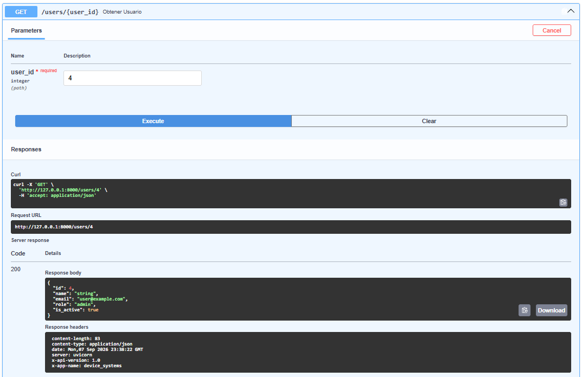

# device_systems

API desarrollada con **Python y FastAPI** para la gestión de usuarios mediante diferentes endpoints. El proyecto permite consultar usuarios, consultar un usuario específico y registrar nuevos usuarios a través de una API REST.

La documentación y las pruebas de los endpoints se realizan mediante **Swagger UI**, proporcionado automáticamente por FastAPI.

---

## Tecnologías utilizadas

* Python
* FastAPI
* Uvicorn
* Swagger UI
* Entorno virtual de Python (`venv`)

---

## Descripción de la aplicación

`device_systems` es una aplicación backend desarrollada con FastAPI que permite trabajar con información de usuarios.

La API cuenta con endpoints para:

* Consultar todos los usuarios.
* Consultar un usuario específico mediante su ID.
* Registrar nuevos usuarios.

La aplicación utiliza Swagger UI para facilitar la documentación, visualización y prueba de los diferentes endpoints disponibles.

---

## Instalación de dependencias

Primero se debe crear y activar el entorno virtual.

### Crear entorno virtual

```bash
python -m venv venv
```

### Activar entorno virtual en Windows

```bash
.\venv\Scripts\activate
```

### Instalar dependencias

```bash
pip install fastapi uvicorn
```

Si el proyecto cuenta con un archivo `requirements.txt`:

```bash
pip install -r requirements.txt
```

---

## Ejecución del servidor

Para iniciar el servidor de desarrollo se utiliza Uvicorn:

```bash
uvicorn main:app --reload
```

El servidor estará disponible en:

```text
http://127.0.0.1:8000
```

La documentación interactiva de Swagger UI se encuentra en:

```text
http://127.0.0.1:8000/docs
```

---

## Swagger UI

FastAPI genera automáticamente una interfaz de documentación interactiva mediante Swagger UI.

Desde Swagger UI es posible:

* Visualizar los endpoints.
* Consultar los métodos HTTP disponibles.
* Ejecutar peticiones.
* Enviar parámetros.
* Enviar información en formato JSON.
* Revisar las respuestas de la API.

---

## Tabla de endpoints

| Método | Endpoint           | Descripción                                   |
| ------ | ------------------ | --------------------------------------------- |
| GET    | `/users/`          | Obtiene la lista de usuarios.                 |
| GET    | `/users/{user_id}` | Obtiene un usuario específico mediante su ID. |
| POST   | `/users/`          | Registra un nuevo usuario.                    |

---

## Ejemplos de peticiones

### GET `/users/`

Permite obtener todos los usuarios registrados.

```http
GET /users/
```

Ejemplo de respuesta:

```json
[
  {
    "id": 1,
    "name": "Carlos",
    "email": "carlos@example.com",
    "role": "admin",
    "is_active": true
  },
  {
    "id": 2,
    "name": "Laura",
    "email": "laura@example.com",
    "role": "support",
    "is_active": true
  },
  {
    "id": 3,
    "name": "Miguel",
    "email": "miguel@example.com",
    "role": "user",
    "is_active": false
  }
]
```

---

### GET `/users/{user_id}`

Permite consultar un usuario específico mediante su ID.

```http
GET /users/1
```

Ejemplo de respuesta:

```json
{
  "id": 1,
  "name": "Carlos",
  "email": "carlos@example.com",
  "role": "admin",
  "is_active": true
}
```

---

### POST `/users/`

Permite registrar un nuevo usuario.

```http
POST /users/
```

Ejemplo de cuerpo JSON:

```json
{
  "name": "Andres",
  "email": "andres@example.com",
  "role": "user",
  "is_active": true
}
```

---

# Evidencias de Swagger UI

## Evidencia01 — Swagger UI funcionando

Swagger UI cargado correctamente, mostrando los endpoints disponibles de la aplicación.


---

## Evidencia02 — GET `/users/`

Prueba del endpoint `GET /users/`, obteniendo correctamente la lista de usuarios registrados.


---

## Evidencia03 — GET `/users/{user_id}`

Prueba del endpoint `GET /users/{user_id}`, consultando correctamente el usuario mediante su ID.



---

## Evidencia04 — POST `/users/`

Prueba del endpoint `POST /users/`, enviando correctamente la información de un nuevo usuario.


---

## Estructura del proyecto

```text
device_systems/
│
├── app/
│   ├── __init__.py
│   ├── main.py
│   │
│   ├── schemas/
│   │   ├── __init__.py
│   │   └── user_schema.py
│   │
│   └── routes/
│       ├── __init__.py
│       └── user_routes.py
│
├── evidencias/
│   ├── Evidencia01.png
│   ├── Evidencia02.png
│   ├── Evidencia03.png
│   └── Evidencia04.png
│
├── .env
├── .env.example
├── .gitignore
├── README.md
├── pyproject.toml
├── requirements.txt
└── uv.lock
```

---

## Estado del proyecto

* ✅ Proyecto `device_systems` creado.
* ✅ Entorno virtual configurado.
* ✅ FastAPI instalado.
* ✅ Uvicorn funcionando.
* ✅ Servidor ejecutándose correctamente.
* ✅ Swagger UI disponible.
* ✅ Endpoints documentados.
* ✅ Peticiones GET probadas.
* ✅ Petición POST probada.
* ✅ Evidencias de funcionamiento incluidas.

---

## Autor

**Stiven Hurtado Valencia**

Proyecto desarrollado como parte del proceso de formación en **Análisis y Desarrollo de Software (ADSO) – SENA**.
