# device_systems

API REST desarrollada con **FastAPI** para la gestión de usuarios, dispositivos y préstamos, utilizando persistencia de datos con **SQLAlchemy**, migraciones con **Alembic** y diferentes mecanismos de seguridad para proteger los recursos de la aplicación.

Proyecto desarrollado como parte de la formación **Tecnólogo en Análisis y Desarrollo de Software (ADSO) del SENA**.

---

## 👨‍💻 Información del proyecto

**Aprendiz:** Stiven Hurtado Valencia
**Programa:** Análisis y Desarrollo de Software – ADSO
**SENA**
**Proyecto:** device_systems

---

# 📌 Descripción

`device_systems` es una API REST construida con **FastAPI** que permite administrar usuarios, dispositivos y préstamos.

El proyecto comenzó con una implementación básica de gestión de usuarios y posteriormente fue evolucionando para incorporar persistencia de datos, relaciones entre entidades, migraciones de base de datos y diferentes mecanismos de seguridad.

En su versión actual se incorporan mecanismos de autenticación y autorización, validaciones avanzadas con **Pydantic v2**, middleware personalizado, configuración de **CORS** y **Rate Limiting** para proteger los diferentes endpoints de la API.

---

# 🚀 Tecnologías utilizadas

* Python
* FastAPI
* SQLAlchemy
* Alembic
* Pydantic v2
* SQLite
* Passlib
* bcrypt
* python-jose
* OAuth2
* JWT
* SlowAPI
* python-multipart
* Uvicorn
* UV
* Git
* Git Flow
* Swagger UI
* OpenAPI

---

# 📂 Estructura del proyecto

La estructura principal del proyecto se encuentra organizada de la siguiente manera:

```text
device_systems/
│
├── app/
│   ├── main.py
│   │
│   ├── auth/
│   │   ├── auth_routes.py
│   │   ├── auth_service.py
│   │   └── security.py
│   │
│   ├── database/
│   │   └── connection.py
│   │
│   ├── models/
│   │   ├── user_model.py
│   │   ├── device_model.py
│   │   └── loan_model.py
│   │
│   ├── schemas/
│   │   ├── user_schema.py
│   │   ├── device_schema.py
│   │   ├── loan_schema.py
│   │   └── auth_schema.py
│   │
│   ├── routes/
│   │   ├── user_routes.py
│   │   ├── device_routes.py
│   │   └── loan_routes.py
│   │
│   ├── services/
│   │   ├── user_service.py
│   │   ├── device_service.py
│   │   └── loan_service.py
│   │
│   ├── dependencies/
│   │   ├── database_dependency.py
│   │   └── auth_dependency.py
│   │
│   └── middlewares/
│       └── request_middleware.py
│
├── alembic/
│   ├── versions/
│   └── env.py
│
├── evidencias/
│   └── EV11/
│
├── .env
├── .env.example
├── .gitignore
├── alembic.ini
├── pyproject.toml
├── requirements.txt
├── README.md
└── uv.lock
```

### Evidencia de la estructura

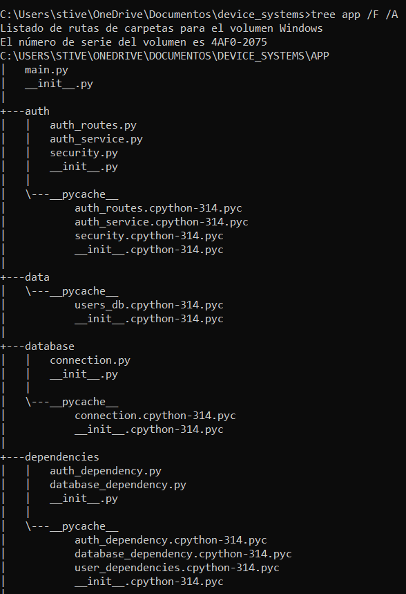

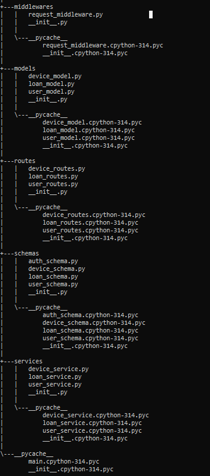

---

# 🗄️ Base de datos y persistencia

La aplicación utiliza **SQLite** como sistema de base de datos y **SQLAlchemy** como ORM.

La conexión se encuentra en:

```text
app/database/connection.py
```

La base de datos permite mantener la información de los usuarios, dispositivos y préstamos de manera persistente.

Las entidades principales del proyecto son:

* `User`
* `Device`
* `Loan`

También se implementaron relaciones entre las entidades para permitir la gestión de préstamos y la consulta de información relacionada.

---

# 🔄 Alembic

Para controlar los cambios realizados en la estructura de la base de datos se utiliza **Alembic**.

Las migraciones permiten registrar los cambios realizados sobre los modelos y mantener controlada la evolución de la base de datos.

La migración relacionada con la seguridad agrega los campos necesarios para la autenticación de usuarios, entre ellos:

* `hashed_password`
* `role`
* `is_active`

La revisión final corresponde a:

```text
95746284a442 (head)
add authentication fields to users
```

Las revisiones principales utilizadas en el proyecto son:

```text
<base> -> 226c24a90b7c
crear dispositivos y prestamos

226c24a90b7c -> 95746284a442
add authentication fields to users
```

### Evidencia de Alembic

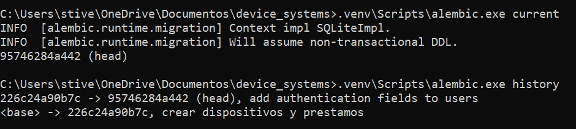

---

# 🔐 Seguridad de contraseñas

Las contraseñas de los usuarios **no se almacenan directamente en la base de datos**.

Antes de guardar una contraseña, esta se transforma mediante un proceso de hash utilizando **Passlib y bcrypt**.

El sistema implementa las funciones:

```text
get_password_hash(password)
verify_password(plain_password, hashed_password)
```

De esta manera, la contraseña original no queda almacenada como texto plano.

Además, el campo:

```text
hashed_password
```

no se incluye en las respuestas de la API.

---

# 👤 Autenticación

La autenticación de la API se implementó utilizando:

* OAuth2
* JWT
* Bearer Token
* Passlib
* bcrypt

El flujo general de autenticación es:

```text
Registro
   ↓
Validación de datos
   ↓
Hash de contraseña
   ↓
Guardar usuario
   ↓
Login
   ↓
Validar credenciales
   ↓
Generar JWT
   ↓
Enviar Bearer Token
   ↓
Acceder a recursos protegidos
```

---

# 📝 Registro de usuarios

El endpoint:

```http
POST /auth/register
```

permite registrar nuevos usuarios.

Durante el registro se validan:

* Nombre
* Correo electrónico
* Contraseña
* Rol
* Estado del usuario
* Unicidad del correo electrónico

La contraseña debe cumplir con los requisitos establecidos para garantizar una validación mínima de seguridad.

### Evidencia de registro

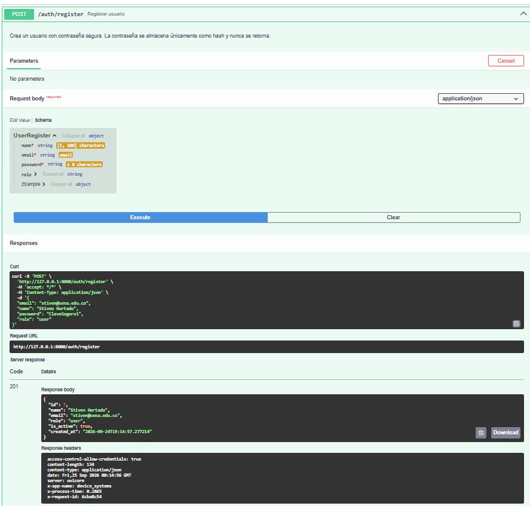

---

# 🔑 Validación de contraseñas

La API utiliza validaciones mediante **Pydantic v2** para controlar la información enviada por el usuario.

La contraseña debe cumplir con las siguientes condiciones:

* Tener mínimo 8 caracteres.
* Contener una letra mayúscula.
* Contener una letra minúscula.
* Contener un número.
* No contener espacios.

También se valida que el correo electrónico tenga un formato válido y que no se encuentre registrado previamente.

---

# 🔓 Inicio de sesión

El endpoint:

```http
POST /auth/login
```

permite autenticar un usuario mediante sus credenciales.

Durante el inicio de sesión se comprueba:

1. Que el usuario exista.
2. Que la contraseña sea correcta.
3. Que las credenciales sean válidas.
4. Que el usuario pueda autenticarse.

Cuando el inicio de sesión es correcto, la API genera un **JWT**.

La respuesta tiene la siguiente estructura:

```json
{
  "access_token": "token_generado",
  "token_type": "bearer"
}
```

El endpoint permite recibir las credenciales mediante JSON y también mediante formulario compatible con OAuth2.

### Evidencia de login y token

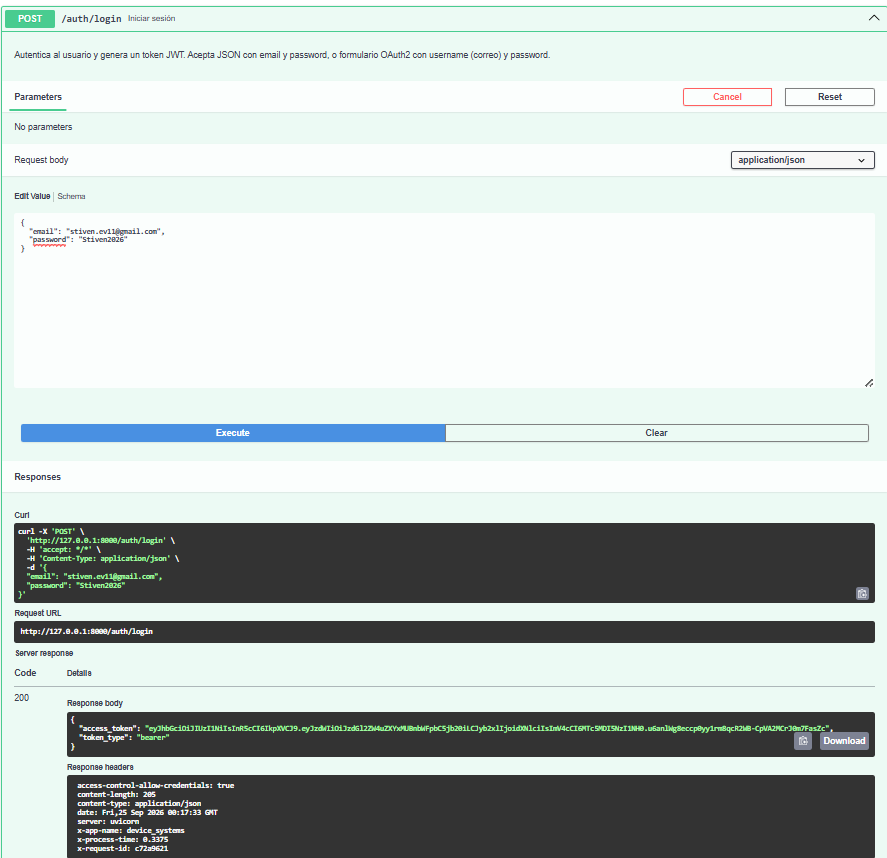

---

# 👤 Endpoint /auth/me

El endpoint:

```http
GET /auth/me
```

permite consultar la información del usuario que actualmente se encuentra autenticado.

Para utilizarlo es necesario enviar el token mediante el encabezado:

```http
Authorization: Bearer TOKEN
```

La respuesta contiene información del usuario autenticado, pero no expone la contraseña ni el hash de la contraseña.

Ejemplo:

```json
{
  "id": 6,
  "name": "Stiven EV11",
  "email": "stiven.ev11@gmail.com",
  "role": "user",
  "is_active": true,
  "created_at": "2026-09-24T19:07:17.452901"
}
```

### Evidencia de /auth/me

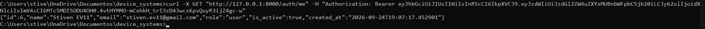

---

# 🛡️ Protección de endpoints

Los recursos protegidos utilizan dependencias de autenticación y autorización.

Se implementaron las siguientes dependencias:

```text
get_current_user
get_current_active_user
require_admin
require_admin_or_support
```

Estas dependencias permiten comprobar:

* Que exista un token.
* Que el token sea válido.
* Que el usuario exista.
* Que el usuario esté activo.
* Que el usuario tenga el rol requerido.

---

# 👥 Roles y permisos

La aplicación maneja los siguientes roles:

```text
admin
support
user
```

Los permisos dependen del rol del usuario.

### Usuarios autenticados

Los usuarios autenticados pueden acceder a:

```http
GET /users
GET /users/{user_id}
POST /loans
```

### Administradores y soporte

Los usuarios con rol `admin` o `support` pueden realizar operaciones como:

```http
POST /devices
PUT /devices/{device_id}
PATCH /loans/{loan_id}/return
GET /loans/details
```

### Administradores

El rol `admin` tiene permisos para eliminar dispositivos:

```http
DELETE /devices/{device_id}
```

De esta forma, las operaciones administrativas quedan restringidas según los permisos establecidos.

---

# 🚫 Acceso sin token

Los endpoints protegidos requieren autenticación.

Cuando se intenta acceder a una ruta protegida sin enviar un token válido, la API responde con:

```http
401 Unauthorized
```

### Evidencia de acceso sin token

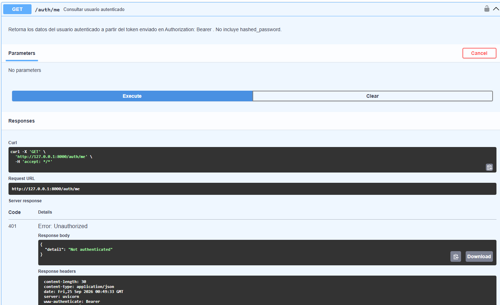

---

# 🚫 Acceso con rol no autorizado

La autenticación y la autorización son procesos diferentes.

Un usuario puede tener un token válido y aun así no tener permisos suficientes para realizar una determinada operación.

Cuando el usuario está autenticado pero su rol no tiene autorización para realizar la operación solicitada, la API responde con:

```http
403 Forbidden
```

### Evidencia de rol no autorizado

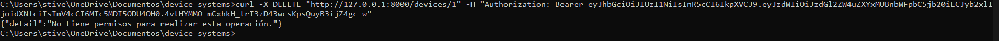

---

# 📖 Swagger y OpenAPI

FastAPI genera automáticamente la documentación de la API mediante **Swagger UI** y **OpenAPI**.

La documentación permite visualizar:

* Endpoints.
* Parámetros.
* Modelos de entrada.
* Modelos de respuesta.
* Códigos de estado.
* Esquema de autenticación OAuth2.
* Recursos protegidos.
* Información de seguridad.

Swagger permite utilizar el botón **Authorize** para ingresar el Bearer Token y probar los endpoints protegidos.

### Evidencia de Swagger y OAuth2

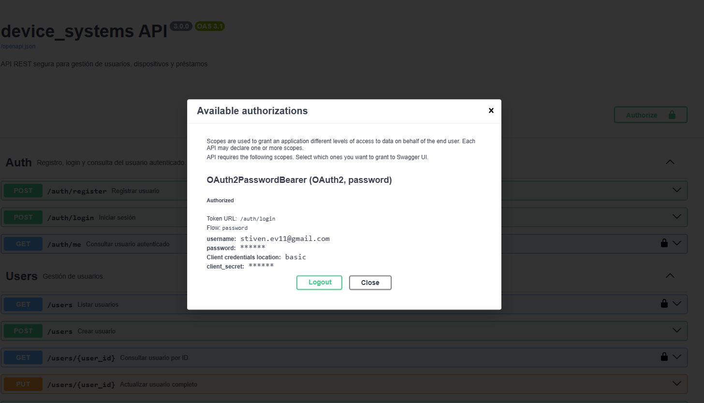

---

# 🌐 CORS

Se configuró **CORS (Cross-Origin Resource Sharing)** mediante `CORSMiddleware` de FastAPI.

Durante el desarrollo se permiten los orígenes necesarios para trabajar con aplicaciones frontend locales, como:

```text
http://localhost:5173
http://localhost:3000
```

La configuración permite:

```text
allow_credentials=True
allow_methods=["*"]
allow_headers=["*"]
```

CORS permite controlar qué aplicaciones externas pueden realizar solicitudes hacia la API.

El uso de `*` debe manejarse con cuidado en producción, especialmente cuando se utilizan credenciales. En un entorno productivo es recomendable especificar únicamente los dominios que realmente necesitan acceder a la API.

---

# ⚙️ Middleware personalizado

Se implementó un middleware personalizado para controlar y registrar información relacionada con las solicitudes HTTP.

El middleware realiza las siguientes funciones:

* Mide el tiempo de procesamiento de cada solicitud.
* Agrega el encabezado `X-Process-Time`.
* Agrega el encabezado `X-App-Name`.
* Genera o conserva un `X-Request-ID`.
* Registra el método HTTP.
* Registra la ruta solicitada.
* Registra el código de estado de la respuesta.

Los encabezados principales utilizados son:

```text
X-App-Name: device_systems
X-Process-Time: 0.0042
X-Request-ID: identificador-de-la-solicitud
```

Estos encabezados ayudan a identificar y realizar seguimiento a las solicitudes realizadas a la API.

### Evidencia del middleware

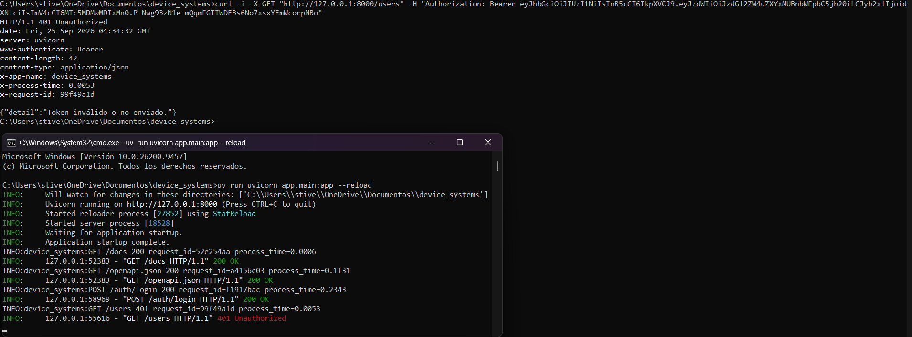

---

# 🚦 Rate Limiting

Para limitar la cantidad de solicitudes realizadas a determinados endpoints se implementó **SlowAPI**.

Los límites configurados son:

| Endpoint              |                    Límite |
| --------------------- | ------------------------: |
| `POST /auth/login`    |  5 solicitudes por minuto |
| `POST /auth/register` |  3 solicitudes por minuto |
| `GET /users`          | 30 solicitudes por minuto |
| `POST /loans`         | 10 solicitudes por minuto |

Cuando se supera el límite configurado, la API responde con:

```http
429 Too Many Requests
```

El Rate Limiting proporciona una medida adicional para controlar solicitudes excesivas sobre los recursos de la API.

### Evidencia de Rate Limiting

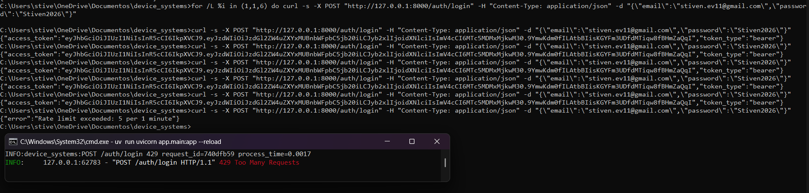

---

# 🧪 Pruebas funcionales de seguridad

Durante el desarrollo se realizaron diferentes pruebas para comprobar el funcionamiento de la autenticación, autorización y mecanismos de seguridad.

| #  | Prueba                                    | Resultado esperado                  |
| -- | ----------------------------------------- | ----------------------------------- |
| 1  | Registrar usuario                         | Usuario creado correctamente        |
| 2  | Registrar con contraseña débil            | `422 Unprocessable Entity`          |
| 3  | Registrar correo duplicado                | Error por correo existente          |
| 4  | Login correcto                            | Generación de JWT                   |
| 5  | Login con contraseña incorrecta           | Error de autenticación              |
| 6  | Consultar `/auth/me`                      | Información del usuario autenticado |
| 7  | Acceder a ruta protegida sin token        | `401 Unauthorized`                  |
| 8  | Acceder con token inválido                | `401 Unauthorized`                  |
| 9  | Acceder con rol no autorizado             | `403 Forbidden`                     |
| 10 | Crear dispositivo con rol permitido       | Operación autorizada                |
| 11 | Eliminar dispositivo con rol no permitido | `403 Forbidden`                     |
| 12 | Verificar configuración CORS              | Configuración aplicada              |
| 13 | Verificar middleware                      | Encabezados agregados               |
| 14 | Superar límite de solicitudes             | `429 Too Many Requests`             |
| 15 | Verificar Swagger/OpenAPI                 | Documentación y OAuth2 disponibles  |

---

# 📋 Evidencias EV11

Las evidencias correspondientes a la implementación de seguridad se encuentran en:

```text
evidencias/EV11/
```

## EV11-01 — Estructura del proyecto

La estructura del proyecto se evidencia mediante dos capturas para mostrar las diferentes partes de la organización de carpetas y archivos.


---

## EV11-02 — Estado de Alembic

Se evidencia el estado actual de las migraciones de la base de datos y la revisión utilizada por el proyecto.


---

## EV11-03 — Registro de usuario

Se evidencia el registro de un usuario mediante el endpoint `/auth/register`.


---

## EV11-04 — Login y generación del token

Se evidencia el inicio de sesión y la generación del token JWT.


---

## EV11-05 — Usuario autenticado mediante /auth/me

Se evidencia el acceso al endpoint `/auth/me` utilizando un Bearer Token válido.


---

## EV11-06 — Acceso sin token

Se evidencia la protección de una ruta que requiere autenticación. Al realizar la solicitud sin un token válido, la API responde con `401 Unauthorized`.


---

## EV11-07 — Acceso con rol no autorizado

Se evidencia el control de permisos mediante roles. Un usuario autenticado que no cuenta con los permisos necesarios recibe una respuesta `403 Forbidden`.


---

## EV11-08 — Swagger y OAuth2

Se evidencia la documentación automática de FastAPI y la configuración del esquema de autenticación OAuth2/Bearer Token en Swagger UI.


---

## EV11-09 — Middleware y encabezados

Se evidencia el funcionamiento del middleware personalizado mediante los encabezados de respuesta:

* `X-App-Name`
* `X-Process-Time`
* `X-Request-ID`


---

## EV11-10 — Rate Limiting

Se evidencia la aplicación del límite de solicitudes mediante SlowAPI y la respuesta correspondiente al superar el límite configurado.


---

# 📚 Documentación de la API

La aplicación utiliza la documentación automática proporcionada por FastAPI.

Con el servidor ejecutándose localmente se puede acceder a:

```text
http://127.0.0.1:8000/docs
```

Swagger permite consultar los diferentes endpoints y utilizar el esquema de autenticación OAuth2/Bearer Token.

También se encuentra disponible la documentación alternativa de ReDoc:

```text
http://127.0.0.1:8000/redoc
```

---

# ▶️ Ejecución del proyecto

El proyecto utiliza **UV** para la gestión del entorno virtual y las dependencias.

Para instalar las dependencias:

```bash
uv sync
```

Para ejecutar el servidor:

```bash
uv run uvicorn app.main:app --reload
```

La API estará disponible en:

```text
http://127.0.0.1:8000
```

Swagger:

```text
http://127.0.0.1:8000/docs
```

ReDoc:

```text
http://127.0.0.1:8000/redoc
```

---

# 🔧 Variables de entorno

El proyecto utiliza un archivo `.env` para manejar variables de configuración.

También se incluye el archivo:

```text
.env.example
```

como referencia para las variables necesarias.

Las variables relacionadas con seguridad y credenciales no deben publicarse directamente en el repositorio.

El archivo `.env` debe mantenerse fuera del control de versiones cuando contenga información sensible.

---

# 🔄 Git Flow

Durante el desarrollo del proyecto se utilizó Git y Git Flow para organizar las diferentes etapas de trabajo.

Entre las ramas utilizadas durante el desarrollo se encuentran:

```text
main
develop
feature/fastapi-intermedio
feature/sqlalchemy-crud
```

Para la evolución de seguridad de la API se utiliza la rama:

```text
device_systems_security
```

La integración final se realiza siguiendo el flujo de trabajo establecido para el proyecto.

---

# 🔒 Importancia de la seguridad en una API REST

La seguridad es una parte fundamental del desarrollo de una API REST, especialmente cuando se manejan datos de usuarios y operaciones que pueden modificar información.

En este proyecto se implementaron diferentes mecanismos que trabajan de manera conjunta:

* Hash de contraseñas.
* Autenticación mediante JWT.
* OAuth2.
* Protección de endpoints.
* Control de acceso mediante roles.
* Validación de datos.
* CORS.
* Middleware.
* Identificación de solicitudes mediante `X-Request-ID`.
* Limitación de solicitudes mediante Rate Limiting.
* Documentación de seguridad mediante OpenAPI y Swagger.

Estas medidas permiten que la API no solamente cumpla con las operaciones funcionales solicitadas, sino que también tenga controles para proteger los recursos y restringir operaciones según el usuario autenticado.

La implementación de seguridad también permite identificar mejor los errores, controlar el acceso a los recursos y reducir riesgos relacionados con credenciales, solicitudes excesivas y accesos no autorizados.

---

# ✅ Conclusiones

Durante el desarrollo de `device_systems` se pasó de una API básica a una aplicación con persistencia de datos, relaciones entre entidades y diferentes mecanismos de seguridad.

Se implementó autenticación mediante JWT, validación avanzada con Pydantic, control de permisos mediante roles, protección de rutas, CORS, middleware personalizado y limitación de solicitudes.

También se utilizaron Alembic y SQLAlchemy para mantener organizada la estructura de la base de datos y facilitar la evolución del proyecto.

Finalmente, las pruebas realizadas permitieron comprobar el comportamiento de la API ante accesos autorizados, accesos sin autenticación, usuarios sin permisos suficientes, credenciales incorrectas y exceso de solicitudes.

---

# 👨‍🎓 Autor

**Stiven Hurtado Valencia**

**SENA – Análisis y Desarrollo de Software (ADSO)**

Proyecto académico `device_systems`.
