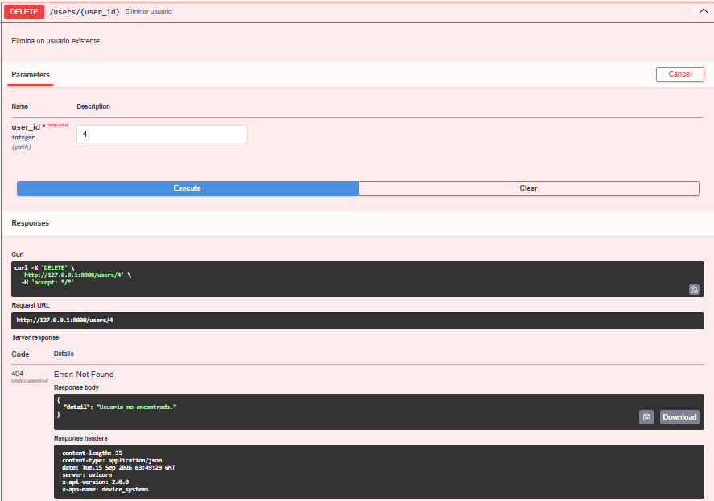
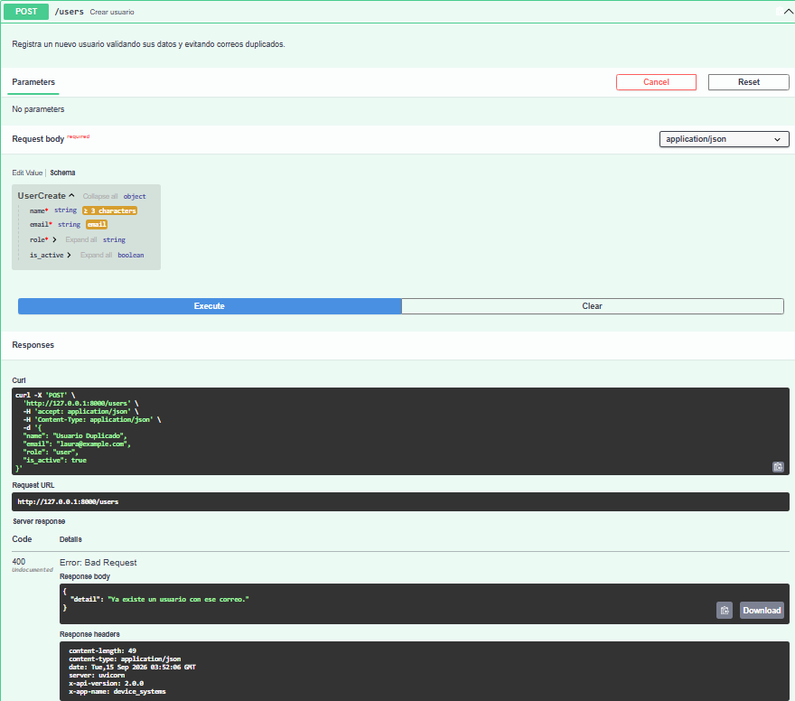
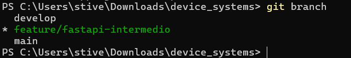
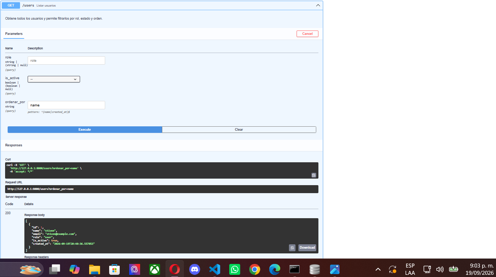

# device_systems

API REST desarrollada con **Python, FastAPI y SQLAlchemy** para la gestión de usuarios. Esta versión permite registrar, consultar, actualizar y eliminar usuarios, almacenando la información de forma persistente en una base de datos SQLite.

El proyecto hace parte del proceso de formación del programa **Análisis y Desarrollo de Software (ADSO) – SENA**.

---

## Tecnologías utilizadas

* Python 3.14
* FastAPI
* SQLAlchemy
* SQLite
* Pydantic v2
* Uvicorn
* Swagger UI
* ReDoc
* UV
* tzdata
* Git y Git Flow

---

## Descripción del proyecto

`device_systems` es una API REST que permite administrar usuarios mediante diferentes endpoints.

En esta versión se reemplazó el almacenamiento temporal en memoria por una base de datos SQLite, utilizando SQLAlchemy para realizar las operaciones de persistencia.

La aplicación permite:

* Registrar usuarios.
* Consultar todos los usuarios.
* Consultar un usuario por su ID.
* Actualizar completamente un usuario.
* Actualizar parcialmente un usuario.
* Eliminar usuarios.
* Filtrar usuarios por rol.
* Filtrar usuarios por estado.
* Ordenar los resultados por nombre o fecha de creación.
* Validar los datos recibidos mediante Pydantic.
* Evitar el registro de correos duplicados.
* Validar los roles permitidos.
* Manejar usuarios inexistentes.
* Manejar errores mediante códigos de respuesta HTTP.
* Mantener los registros almacenados después de reiniciar el servidor.

Los datos se almacenan en el archivo `device_systems.db`, por lo que permanecen disponibles después de detener y volver a iniciar la aplicación.

---

## Estructura del proyecto

```text
device_systems/
├── app/
│   ├── main.py
│   ├── __init__.py
│   │
│   ├── database/
│   │   ├── connection.py
│   │   └── __init__.py
│   │
│   ├── models/
│   │   ├── user_model.py
│   │   └── __init__.py
│   │
│   ├── schemas/
│   │   ├── user_schema.py
│   │   └── __init__.py
│   │
│   ├── routes/
│   │   ├── user_routes.py
│   │   └── __init__.py
│   │
│   ├── services/
│   │   ├── user_service.py
│   │   └── __init__.py
│   │
│   └── dependencies/
│       ├── database_dependency.py
│       └── __init__.py
│
├── evidencias/
├── device_systems.db
├── .env
├── .env.example
├── .gitignore
├── README.md
├── pyproject.toml
├── requirements.txt
└── uv.lock
```

---

## Organización del código

### `app/main.py`

Es el archivo principal de la aplicación. Configura FastAPI, crea las tablas de la base de datos y registra las rutas de usuarios.

### `app/database/connection.py`

Configura la conexión con SQLite mediante SQLAlchemy. También define el motor de conexión, las sesiones y la clase base de los modelos.

La base de datos utilizada es:

```text
sqlite:///./device_systems.db
```

### `app/models/user_model.py`

Contiene el modelo `User`, que representa la tabla `users` en la base de datos.

El modelo contiene los siguientes campos:

* `id`
* `name`
* `email`
* `role`
* `is_active`
* `created_at`

La fecha de creación utiliza la zona horaria:

```text
America/Bogota
```

### `app/schemas/user_schema.py`

Contiene los esquemas de Pydantic utilizados para validar los datos de entrada y definir la información que devuelve la API.

### `app/routes/user_routes.py`

Define los endpoints de la API y recibe las solicitudes HTTP.

### `app/services/user_service.py`

Contiene la lógica de las operaciones CRUD, las consultas, los filtros, el ordenamiento y las validaciones de negocio.

### `app/dependencies/database_dependency.py`

Contiene la dependencia `get_db`, que proporciona una sesión de base de datos a los endpoints y la cierra al terminar la solicitud.

---

## SQLAlchemy y Pydantic

En el proyecto se utilizan SQLAlchemy y Pydantic para responsabilidades diferentes.

### Modelo SQLAlchemy

El modelo `User`, ubicado en:

```text
app/models/user_model.py
```

representa la tabla `users` de SQLite.

Define los campos y las restricciones de almacenamiento:

* `id`: identificador del usuario y clave primaria.
* `name`: nombre del usuario.
* `email`: correo electrónico único.
* `role`: rol del usuario.
* `is_active`: estado del usuario.
* `created_at`: fecha y hora de creación.

SQLAlchemy permite consultar, insertar, actualizar y eliminar los registros de la base de datos.

### Esquemas Pydantic

Los esquemas ubicados en:

```text
app/schemas/user_schema.py
```

validan la información recibida y establecen la estructura de las respuestas.

Se utilizan los siguientes esquemas:

* `UserCreate`: datos para registrar un usuario.
* `UserUpdate`: datos para actualizar completamente un usuario.
* `UserPatch`: campos que se pueden modificar parcialmente.
* `UserResponse`: información que devuelve la API.

De esta manera, **SQLAlchemy se encarga de la interacción con la base de datos**, mientras que **Pydantic se encarga de validar y estructurar los datos**.

---

## Base de datos SQLite

El proyecto utiliza SQLite como sistema de almacenamiento relacional.

El archivo de la base de datos es:

```text
device_systems.db
```

La tabla utilizada para almacenar los usuarios es:

```text
users
```

La conexión se configura en:

```text
app/database/connection.py
```

La creación de las tablas se realiza mediante:

```python
Base.metadata.create_all(bind=engine)
```

Esta instrucción permite crear las tablas definidas en los modelos cuando se inicia la aplicación, si todavía no existen.

La información registrada queda almacenada en el archivo de base de datos y puede consultarse nuevamente después de reiniciar el servidor.

---

## Instalación y ejecución

### Requisitos

* Python instalado.
* UV instalado.
* El proyecto descargado o clonado.

### Instalar las dependencias

Desde la carpeta del proyecto, ejecutar:

```bash
uv sync
```

También es posible instalar las dependencias definidas en `requirements.txt`.

### Iniciar el servidor en Windows

Ejecutar:

```powershell
.\.venv\Scripts\python.exe -m uvicorn app.main:app --reload
```

La API estará disponible en:

```text
http://127.0.0.1:8000
```

Para comprobar el funcionamiento:

```text
http://127.0.0.1:8000/
```

---

## Documentación de la API

### Swagger UI

Disponible en:

```text
http://127.0.0.1:8000/docs
```

Desde Swagger UI se pueden consultar y probar los endpoints, enviar parámetros y cuerpos JSON y revisar las respuestas y los códigos HTTP.

### ReDoc

Disponible en:

```text
http://127.0.0.1:8000/redoc
```

ReDoc permite consultar de forma organizada la documentación de la API y sus operaciones.

---

## Endpoints disponibles

| Método | Endpoint           | Descripción                                              | Respuestas principales |
| ------ | ------------------ | -------------------------------------------------------- | ---------------------- |
| GET    | `/users`           | Lista usuarios y permite aplicar filtros y ordenamiento. | 200                    |
| GET    | `/users/{user_id}` | Consulta un usuario por ID.                              | 200 / 404              |
| POST   | `/users`           | Registra un usuario.                                     | 201 / 400 / 422        |
| PUT    | `/users/{user_id}` | Actualiza completamente un usuario.                      | 200 / 400 / 404 / 422  |
| PATCH  | `/users/{user_id}` | Actualiza parcialmente un usuario.                       | 200 / 400 / 404 / 422  |
| DELETE | `/users/{user_id}` | Elimina un usuario.                                      | 204 / 404              |

---

## Filtros y ordenamiento

El endpoint `GET /users` permite consultar usuarios aplicando filtros y ordenamiento.

### Filtrar por rol

```text
GET /users?role=admin
```

Roles permitidos:

```text
admin
support
user
```

### Filtrar por estado

Usuarios activos:

```text
GET /users?is_active=true
```

Usuarios inactivos:

```text
GET /users?is_active=false
```

### Ordenar por nombre

```text
GET /users?ordenar_por=name
```

### Ordenar por fecha de creación

```text
GET /users?ordenar_por=created_at
```

Los filtros pueden combinarse con las opciones de ordenamiento disponibles.

---

## Ejemplos de peticiones

### POST `/users`

Permite registrar un usuario.

Ejemplo de cuerpo JSON:

```json
{
  "name": "Andres Perez",
  "email": "andresperez@example.com",
  "role": "support",
  "is_active": true
}
```

Cuando el registro se realiza correctamente, la API responde con:

```text
201 Created
```

Si el correo ya pertenece a otro usuario, responde con:

```text
400 Bad Request
```

### GET `/users`

Obtiene la lista de usuarios almacenados en la base de datos.

### GET `/users/{user_id}`

Permite consultar un usuario mediante su identificador.

Ejemplo:

```text
GET /users/2
```

Si el usuario no existe, responde con:

```text
404 Not Found
```

### PUT `/users/{user_id}`

Permite actualizar completamente un usuario.

Ejemplo:

```text
PUT /users/2
```

Se deben enviar los campos requeridos para la actualización.

### PATCH `/users/{user_id}`

Permite modificar solamente los campos enviados.

Ejemplo:

```text
PATCH /users/2
```

Cuerpo:

```json
{
  "name": "Andres Perez"
}
```

En este caso solamente se modifica el nombre.

No se permite enviar un PATCH vacío. Si no se envían campos, la API responde con:

```text
400 Bad Request
```

### DELETE `/users/{user_id}`

Permite eliminar un usuario existente.

Ejemplo:

```text
DELETE /users/2
```

Si se elimina correctamente, responde con:

```text
204 No Content
```

Si el usuario no existe, responde con:

```text
404 Not Found
```

---

## Validaciones y manejo de errores

La aplicación utiliza Pydantic y `HTTPException` para validar los datos y manejar diferentes situaciones.

| Código | Significado                                                  |
| ------ | ------------------------------------------------------------ |
| 200    | Operación realizada correctamente.                           |
| 201    | Usuario creado correctamente.                                |
| 204    | Usuario eliminado correctamente, sin contenido de respuesta. |
| 400    | Error en una regla de negocio.                               |
| 404    | Usuario no encontrado.                                       |
| 422    | Error de validación de los datos recibidos.                  |

### Validación del nombre

El nombre debe contener como mínimo tres caracteres.

### Validación del correo

El correo debe tener un formato válido.

Además, no puede existir otro usuario con el mismo correo.

### Validación de roles

Los roles permitidos son:

```text
admin
support
user
```

Si se envía un rol diferente, la API responde con:

```text
400 Bad Request
```

### Validación del estado

El campo `is_active` utiliza valores booleanos:

```text
true
false
```

### Correos duplicados

Antes de crear o actualizar un usuario, el servicio comprueba que el correo no esté asociado a otro registro.

Si ya existe, responde con:

```text
400 Bad Request
```

### Usuarios inexistentes

Cuando se intenta consultar, actualizar o eliminar un usuario que no existe, la API responde con:

```text
404 Not Found
```

### PATCH vacío

Si se intenta realizar una actualización parcial sin enviar ningún campo, la API responde con:

```text
400 Bad Request
```

---

## Inyección de dependencias

Se utiliza la inyección de dependencias de FastAPI mediante `Depends()`.

La dependencia de base de datos se encuentra en:

```text
app/dependencies/database_dependency.py
```

La función `get_db` crea una sesión de SQLAlchemy para atender la solicitud y se encarga de cerrarla al finalizar.

Esto permite que los endpoints utilicen la base de datos sin tener que crear y cerrar manualmente una sesión en cada operación.

---

## Persistencia de datos

Los usuarios se almacenan en SQLite mediante SQLAlchemy.

A diferencia de la versión anterior, los registros no dependen de una lista temporal en memoria.

Para comprobar la persistencia se realizó el siguiente procedimiento:

1. Registrar usuarios desde Swagger UI.
2. Consultarlos mediante `GET /users`.
3. Detener el servidor.
4. Iniciar nuevamente el servidor.
5. Consultar nuevamente `GET /users`.
6. Verificar que los usuarios continuaban disponibles.

El resultado confirmó que los datos permanecen almacenados en:

```text
device_systems.db
```

Por lo tanto, los registros no se pierden al reiniciar el servidor.

---

## Manejo de zona horaria

El campo `created_at` registra la fecha y hora de creación del usuario utilizando la zona horaria:

```text
America/Bogota
```

Para permitir el funcionamiento de esta zona horaria en el entorno de Python se agregó la dependencia:

```text
tzdata
```

Esto permite que las fechas registradas correspondan a la hora de Colombia en lugar de utilizar directamente la hora UTC.

---

# Evidencias

Las siguientes evidencias documentan las pruebas realizadas durante el desarrollo del proyecto.

## Evidencia 01 — Swagger UI

Captura de la documentación interactiva de la API mediante Swagger UI.


---

## Evidencia 02 — GET `/users`

Consulta de la lista de usuarios registrados.


---

## Evidencia 03 — GET `/users/{user_id}`

Consulta de un usuario específico mediante su ID.


---

## Evidencia 04 — POST `/users`

Registro de un usuario mediante el endpoint POST.


---

## Evidencia 05 — PUT `/users/{user_id}`

Actualización completa de un usuario.


---

## Evidencia 06 — PATCH `/users/{user_id}`

Actualización parcial de un usuario.


---

## Evidencia 07 — DELETE `/users/{user_id}`

Eliminación de un usuario.



---

## Evidencia 08 — Usuario inexistente

Prueba de consulta de un usuario que no existe y manejo de respuesta `404 Not Found`.


---

## Evidencia 09 — Correo duplicado

Prueba de registro utilizando un correo electrónico que ya existe y manejo de respuesta `400 Bad Request`.



---

## Evidencia 10 — Validación de datos

Prueba de datos que no cumplen las validaciones de Pydantic y respuesta `422 Unprocessable Entity`.


---

## Evidencia 11 — PATCH vacío

Prueba de actualización parcial sin enviar campos y manejo del error `400 Bad Request`.


---

## Evidencia 12 — DELETE de usuario inexistente

Prueba de eliminación de un usuario que no existe y respuesta `404 Not Found`.


---

## Evidencia 13 — ReDoc

Captura de la documentación de la API mediante ReDoc.


---

## Evidencia 14 — ReDoc y endpoints

Segunda captura de la documentación de la API mostrando los endpoints disponibles.



---

## Evidencia 15 — Estructura final del proyecto

Captura de la estructura final del proyecto mediante el comando:

```text
tree app /F
```

La evidencia muestra la organización de los módulos:

* `database`
* `dependencies`
* `models`
* `routes`
* `schemas`
* `services`
* `main.py`


---

## Evidencia 16 — Base de datos SQLite

Captura de la base de datos `device_systems.db`, mostrando la tabla `users` y los registros almacenados.

La evidencia permite comprobar que los usuarios creados mediante la API están siendo almacenados de forma persistente.


---

## Evidencia 17 — Persistencia después de reiniciar el servidor

Se detuvo el servidor FastAPI y posteriormente se inició nuevamente.

Después del reinicio se ejecutó:

```text
GET /users
```

Los usuarios registrados anteriormente continuaron disponibles.

Esta evidencia demuestra que la información permanece almacenada en SQLite y no depende únicamente de la memoria del servidor.



---

## Git Flow

Para organizar el desarrollo se utilizaron ramas de Git.

La implementación de SQLAlchemy y persistencia se trabajó en:

```text
feature/sqlalchemy-crud
```

También se utilizaron las ramas:

```text
main
develop
feature/fastapi-intermedio
feature/sqlalchemy-crud
```

Estructura general:

```text
main
└── develop
    ├── feature/fastapi-intermedio
    └── feature/sqlalchemy-crud
```

La rama `feature/sqlalchemy-crud` contiene la implementación relacionada con SQLAlchemy, SQLite y las operaciones CRUD sobre la base de datos.

---

## Estado final del proyecto

El proyecto cuenta actualmente con:

* [x] FastAPI configurado.
* [x] SQLAlchemy implementado.
* [x] SQLite configurado.
* [x] Modelo `User`.
* [x] Esquemas Pydantic.
* [x] Dependencia de base de datos.
* [x] Operación de creación de usuarios.
* [x] Consulta de usuarios.
* [x] Consulta por ID.
* [x] Actualización completa mediante PUT.
* [x] Actualización parcial mediante PATCH.
* [x] Eliminación de usuarios.
* [x] Filtro por rol.
* [x] Filtro por estado.
* [x] Ordenamiento por nombre.
* [x] Ordenamiento por fecha de creación.
* [x] Validación de datos.
* [x] Validación de roles.
* [x] Validación de correos.
* [x] Control de correos duplicados.
* [x] Manejo de usuarios inexistentes.
* [x] Manejo de errores HTTP.
* [x] Swagger UI.
* [x] ReDoc.
* [x] Persistencia de datos en SQLite.
* [x] Persistencia comprobada después de reiniciar el servidor.
* [x] Manejo de zona horaria `America/Bogota`.
* [x] Dependencia `tzdata`.
* [x] Documentación mediante README.
* [x] Evidencias de funcionamiento.

---

## Reflexión final

Con esta actividad se actualizó el proyecto `device_systems`, pasando del almacenamiento temporal en memoria a una solución con persistencia utilizando **SQLAlchemy y SQLite**.

La implementación permitió trabajar con un modelo de datos para almacenar los usuarios y realizar las operaciones de creación, consulta, actualización y eliminación.

También se reforzó la organización del código mediante la separación de responsabilidades en modelos, esquemas, rutas, servicios, dependencias y conexión a la base de datos.

El uso de Pydantic permitió validar la información recibida por la API, mientras que SQLAlchemy permitió realizar las operaciones sobre la base de datos.

Además, se implementaron filtros, ordenamiento, validaciones de negocio y manejo de errores para mejorar el funcionamiento de los endpoints.

Finalmente, se comprobó la persistencia de los datos reiniciando el servidor y realizando nuevamente la consulta de usuarios. Los registros continuaron disponibles, confirmando que la información está almacenada correctamente en SQLite.

---

## Autor

**Stiven Hurtado Valencia**

**Programa:** Análisis y Desarrollo de Software (ADSO)

**SENA**
